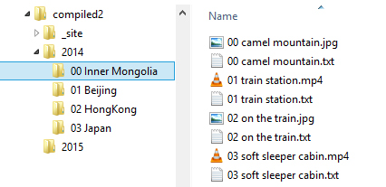
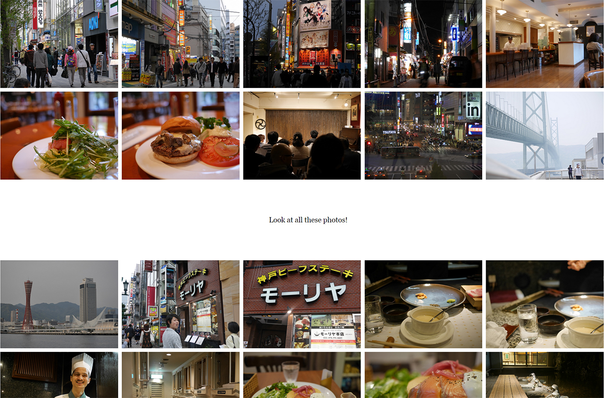
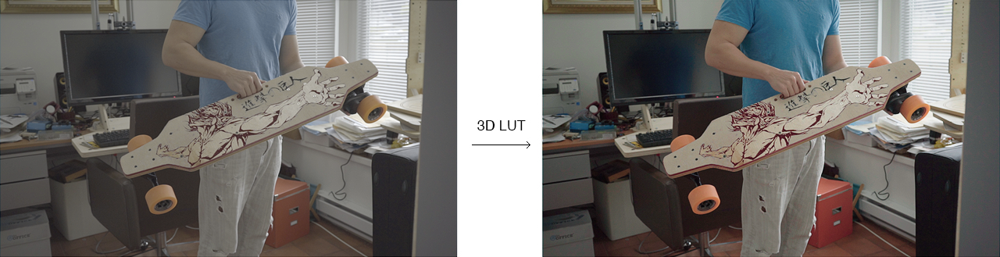
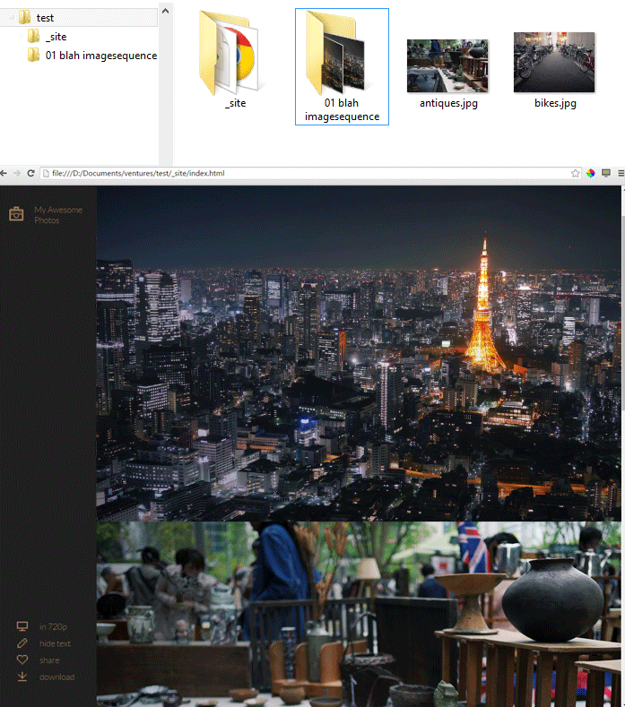

# Galleries and captions

## Folders

Every folder of photos and videos becomes a gallery, and folders can be nested as deep as you like:
the site gets a nested menu to match. A folder that only holds other folders is a section heading
in the menu.



Files and folders whose names start with `_` or `.` are ignored, so drafts (`_unsorted/`), hidden
folders (`.git`, `.thumbs`) and macOS helper files (`.DS_Store`, `._IMG_0001.jpg`) never end up
on the site. Names in any language work: a folder called `Москва` or `Café Zürich` becomes
`москва/` or `café-zürich/` on the site. If two photos end up with the same name once the
numbering is stripped (`01 sunset.jpg` and `02 sunset.jpg`), the one taken first keeps `sunset/`
and the other becomes `sunset-2/`.

## Order

Photos and galleries are sorted by name, with numbers compared as numbers (`1`, `2`, `10`). To
choose the order, put a number in front of the names (`1_DSC0003.jpg`, `2_DSC0002.jpg`, …); it's
left out of the titles and URLs.

Other orders are available with the [`sort`](configuration.md#dorothea-only) setting (or
`--sort`):

- `name`: plain alphabetical order, like expose.sh (`1`, `10`, `2` unless you zero-pad)
- `capture`: in the order the photos were taken (from the camera's EXIF data, else the file date);
  galleries follow their earliest photo, so the whole site reads like the trip
- add `-desc` to reverse any order, e.g. `capture-desc` for newest first

A gallery can choose its own order with a `sort:` line in its `gallery.yml` (below).

## Captions

To add text to a photo, create a Markdown file with the same name: for `DSC0001.jpg`, write
`DSC0001.md`. The photo's own settings go at the top, between two `---` lines (front matter, as
in Jekyll, Hugo or Obsidian); the caption follows:

```markdown
---
title: Chimborazo
top: 60
textcolor: "#ff9518"
---
The summit at dawn, **6,263 m** up.
```

The front matter is YAML, like `_config.yml`: `key: value` lines and `#` comments (handy for
switching a setting off: `# top: 60`). Quote text that starts with `#` (a colour) or contains
`: `, or YAML reads it as something else. If Dorothea can't read the front matter as YAML, or
YAML would lose a value (an unquoted colour reads as a comment), it reads that file the old way
instead and tells you which line to fix; `dorothea check` lists them all. Without front matter,
the whole file is the caption. Windows line endings and a byte-order mark (as Notepad saves)
are fine.

### Captions from Lightroom and other editors

If you fill in a photo's **title** and **caption** in Lightroom (or Capture One, Apple Photos,
darktable…), they're saved in the exported file, and Dorothea shows them as the photo's caption:
the title as a heading, then the description. No text file needed. A caption file (`.md` or
`.txt`) replaces them entirely, title included, so write the whole caption there when you add
one. Turn this off with [`embedded_captions: false`](configuration.md#site-and-theme).

### expose.sh's `.txt` captions

A `DSC0001.txt` works too, as in expose.sh (if a photo has both, the `.md` is used; with
`--legacy`, the `.txt`, as expose.sh does): the caption
is Markdown, and settings are `key: value` lines above a `---`, read line by line, with
everything after the first colon as the value, so colours need no quotes there. The caption must
come *after* the metadata: text placed before the `---` counts as metadata and isn't shown, so
Dorothea warns about it and names the file. `dorothea --convert-config` turns `.txt` captions
into `.md` ones. With `--legacy`, every caption is read line by line, as expose.sh does.

## Gallery settings

A `gallery.yml` in a gallery folder holds settings for every photo in it, and for the gallery
itself (its feed date, download, order); a photo's own caption wins:

```yaml
# Iceland, summer 2022
date: 2022-07-14
description: Two weeks driving around the island.
sort: capture
textbackground: rgba(0,0,0,.4)
```

It's YAML, like `_config.yml`: `key: value` lines, `#` comments, and quotes only for text that
starts with `#` or would read as something else. expose.sh's `metadata.txt` (plain `key: value`
lines) works too; if a folder has both, `gallery.yml` is used. `dorothea --convert-config` turns
every `metadata.txt` into a `gallery.yml`. For example, a gallery-wide
`width: 19` makes a grid in `theme2`:



## Checking for mistakes

`dorothea check` looks through every `gallery.yml`, `metadata.txt` and caption without building
anything, and lists what's wrong, with the file and line:

```
Iceland/gallery.yml:2: sort: 'random' must be one of name, name-desc, natural, …
Iceland/01 falls.md:3: unknown key textbackgroud; did you mean textbackground?
Iceland/01 falls.md:4: sort only works for a whole gallery: put it in gallery.yml
Iceland/02 road.md:2: 'textcolor: #ff9518' reads as empty in YAML; quote the value: …
Iceland/03 geysir.md: no photo or video named 03 geysir.*, so this caption isn't shown
Checked the settings, 4 galleries and 31 captions: 4 problems.
```

It also checks `_config.yml`, and knows which keys your theme reads (the `{{…}}` placeholders in
its `post-template.html`), so it works for custom themes too. It exits with 1 when it finds
something, so it can guard a build in CI.

## Metadata keys

| Key | Description |
|---|---|
| `title` | In a photo's caption: its title in the gallery's own feed (default: the file name without its number). Themes may show it too. |
| `textbackground` | A CSS colour drawn behind the caption text (with a little padding), e.g. `rgba(0,0,0,.5)` to keep white text readable over a bright photo. Works in all bundled themes; put it in `gallery.yml` to apply it to a whole gallery. Values containing `"`, `<`, `>`, `;`, `{`, `}` or `\` are ignored with a warning. |
| `exif` | `false` to show no photo details for this photo (or, in `gallery.yml`, this gallery); `icon` or `caption` to show them that way instead of the [`exif_display`](configuration.md#site-and-theme) style. Only details the caption gives are shown where `exif_display` is `"off"`, since EXIF isn't read then. |
| `camera`, `lens`, `focal_length`, `aperture`, `shutter_speed`, `iso` | Override (or supply) a photo detail shown with `exif_display`, e.g. `lens: Helios 44-2` for a manual lens that records no EXIF, or `aperture: f/2`; `-` hides it (`lens: -`). An `iso` that's just a number is shown as `ISO 400`. |
| `caption_position` | In `contactsheet`, `below` to show this caption (or, in `gallery.yml`, this gallery's captions) under the photo in the grid, or `overlay` to show it over the photo on hover, instead of the [`caption_position`](configuration.md#site-and-theme) setting. |
| `image-options` | Extra ImageMagick `convert` arguments for this photo (needs ImageMagick installed; otherwise ignored with a warning). Not applied to video thumbnails. See [below](#image-options). |
| `video-options` | Extra ffmpeg arguments, e.g. `-ss 10 -t 5` to cut a clip. See [below](#video-options). |
| `video-filters` | ffmpeg filters appended after scaling, e.g. `hflip`. |
| `date` | For the feeds ([`site_url`](configuration.md#site-and-theme)). In a gallery's `gallery.yml`: when the gallery was published, as `2022-07-14`, `2022-07-14 18:30` or full ISO 8601; without it, a gallery's date is when its newest photo was taken (EXIF), else its newest file's time. In a photo's caption: its date in the gallery's own feed, instead of when it was taken. |
| `description` | Only in a gallery's `gallery.yml`, for the feed: the gallery's text in feed readers (Markdown). Without it, the first photo's caption is used. |
| `feed` | Only in a gallery's `gallery.yml`: `false` to not give this gallery its own feed, or `true` to give it one when `gallery_feeds` is off. |
| `download` | Only in a gallery's `gallery.yml`: `false` to not offer this gallery as one zip, or `true` to offer it when `download_album` is off. Doesn't affect the per-photo `download_button`. |
| `sort` | Only in a gallery's `gallery.yml`: the order of that gallery's photos (any `sort` mode, e.g. `natural-desc` for a newest-first log), overriding the site setting. |
| anything else | Available to the theme as `{{key}}`; see [Themes](themes.md) for the keys each theme uses (layout, text colour, …). `color1`…`color7` come from the photo's extracted palette. |

## Video options

Videos go through ffmpeg, so its options and filters can trim or process them without a trip
through a video editor:

```
---
video-options: -ss 10 -t 5
---
```

cuts the video 10 seconds from the start, with a duration of 5 seconds.

```
---
video-filters: lut3d=file=fuji3510.cube
---
```

applies a [film print emulation LUT](http://juanmelara.com.au/print-film-emulation-luts-for-download/),
handy for footage shot in a log profile. ffmpeg looks for the LUT file in the folder you run
Dorothea in, and doesn't read `.look` LUTs: convert them to `.cube`, `.3dl`, `.dat` or `.m3d`.



```
---
video-filters: deshake,unsharp=6:6:3,lutyuv="u=128:v=128"
---
```

stabilises the video, sharpens it slightly, then turns it grey. Separate filters with commas; the
full list is in [ffmpeg's documentation](https://ffmpeg.org/ffmpeg-filters.html#Video-Filters).

## Image options

With ImageMagick installed, `image-options` applies its effects to a photo, non-destructively. Put
it in `gallery.yml` to apply it to a whole gallery:

```
---
image-options: watermark.png -gravity SouthEast -geometry +50+50 -composite
---
```

adds a watermark in the bottom right corner, 50 pixels from the edges.

```
---
image-options: -sharpen 0x1.5
---
```

sharpens the image with a 1.5 pixel radius.

```
---
image-options: -hald-clut transform.png
---
```

applies a colour grade: ImageMagick doesn't read LUTs, but accepts a Hald colour lookup image,
which you can make by applying your LUT to the
[Hald identity CLUT image](http://www.quelsolaar.com/technology/clut.html) in any photo editor.

```
---
image-options: -colorspace Gray -sigmoidal-contrast 5,50%
---
```

makes a black-and-white photo with more contrast (the first number sets the strength). The full
list is in [ImageMagick's documentation](http://www.imagemagick.org/script/command-line-options.php).

## Image sequences

A folder whose name contains `imagesequence` (the
[`sequence_keyword`](configuration.md#video) setting) is turned into a video from its images, at
24 frames per second (`sequence_framerate`): good for timelapses and stop-motion. Video options
and filters apply to image sequences too.


