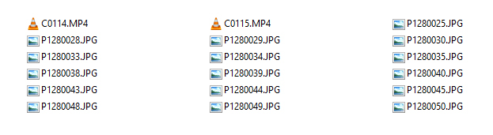

# Dorothea

Dorothea is a [static site generator](https://en.wikipedia.org/wiki/Static_site_generator) for
photography websites, primarily photo essays. It's a Python port of Jack Qiao's
[Exposé](https://github.com/Jack000/Expose), and with `--legacy` it builds the same site
Exposé would.

If you're a photographer, you probably come back home from a trip with photos that look like this:



Dorothea turns those folders into a website, resizing the photos and encoding the videos for the
web. See [Themes](themes.md) for what the sites look like.

## Install

Dorothea runs on Linux, macOS and Windows with Python 3.14+. Everything it needs installs with it,
ffmpeg included.

```bash
uvx dorothea                 # run it once, without installing
uv tool install dorothea     # or install the `dorothea` command
```

If you don't have `uv`, install it from the
[official uv website](https://docs.astral.sh/uv/getting-started/installation/). It picks (and if
needed downloads) the Python 3.14 that Dorothea needs by itself.

[`pipx`](https://github.com/pypa/pipx) works too, but it doesn't choose the Python version on its
own, so ask for 3.14 (pipx downloads it if you don't have it):

```bash
pipx run --python 3.14 --fetch-python=missing dorothea
pipx install --python 3.14 --fetch-python=missing dorothea
```

If `ffmpeg` is already installed, Dorothea uses it instead of its bundled copy. If ImageMagick is
installed, it's used for colour extraction and per-photo `image-options`.

## Make a site

Go to the folder full of photos and run it:

```bash
cd ~/my-trip-to-ecuador
dorothea
```

The site is written to `_site`: put that folder on any web server that serves static files
(including S3 buckets, GitHub Pages, …).

Photos can be JPEG, PNG, GIF, WebP, AVIF, HEIC/HEIF (iPhone) or TIFF; they're published as JPEGs.
Animated GIFs and WebPs use their first frame. Videos in most formats work too (MP4, MOV, MKV,
WebM, AVI, …).

Next: [organise the photos into galleries and add captions](galleries.md), then
[configure the site](configuration.md).

## Preview

```bash
dorothea -d                           # draft: one small size and fast video, for checking layout
dorothea serve                        # build, then preview at http://localhost:8000/
dorothea serve -d                     # same, with a draft build (takes the same flags as dorothea)
dorothea serve --no-build --port 8080 # just serve the existing _site
dorothea serve --bind 0.0.0.0         # reachable from other devices, e.g. a phone on your network
```

Gallery links point at folders, which only work through a web server: if you open
`_site/index.html` straight from disk, clicking a gallery shows a folder listing. Preview with
`dorothea serve` instead, or set `"link_index_html": true` for a site meant to be browsed from
disk.

Re-running only rebuilds what changed: edited photos, changed settings, or changed captions.
There's no need to delete `_site`. On a terminal, the build shows progress bars; output
redirected to a file or a CI log stays plain text. All command-line flags are listed under
[Configuration](configuration.md#command-line).
