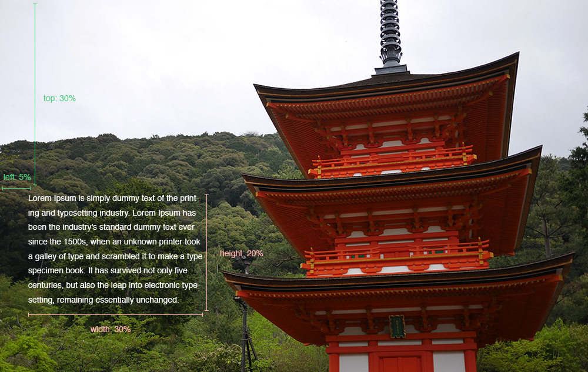
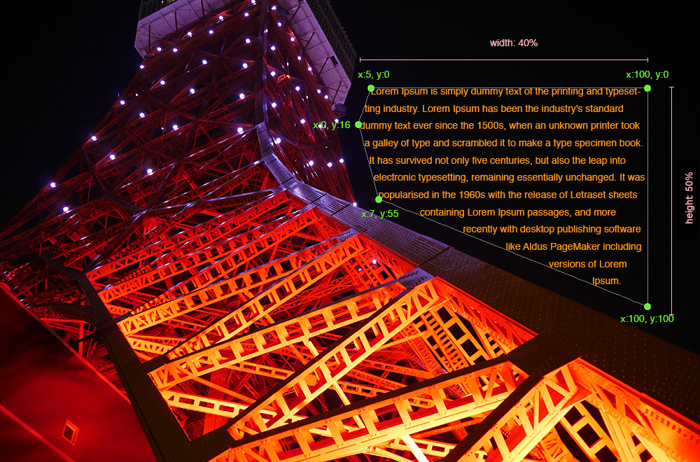
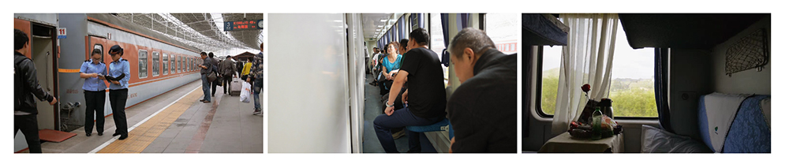

# Themes

Two themes are included, each in two versions: Dorothea's (`photoessay` and `medium`), which get
new features, and Exposé's originals (`theme1` and `theme2`), kept exactly as they were. Pick one
with [`theme_dir`](configuration.md#site-and-theme); the default is `photoessay`.

## photoessay (and the original theme1)

Full-screen photos with the text laid over them. Examples made with the original:

- [Jack Qiao's work blog](https://web.archive.org/web/20260607123708/http://jack.works/)
- [Jack Qiao's photography site](https://jack.ventures/)

Place the text with these metadata keys, in percent of the photo (in a caption, or in
`metadata.txt` for a whole gallery):

```
---
top: 30
left: 5
width: 30
height: 20
textcolor: #ffffff
---
```



To wrap text around a shape, give a `polygon` of 3 or more points, also in percent:

```
---
top: 12
left: 50
width: 40
height: 50
polygon:[{"x":5, "y":0},{"x":100, "y":0},{"x":100, "y":100},{"x":7, "y":55}, {"x":0, "y":16}]
textcolor: #ff9518
---
```



## medium (and the original theme2)

A Medium-style theme, with text in a column between the photos:

- [Jack Qiao's Inner Mongolia](http://jack.ventures/sample/inner-mongolia)

The text goes above its photo, except for the first photo, which is the masthead. Here `width`
sets the photo's width (in percent), so photos can be tiled in a row; clicking a photo shows it
full screen:

```
---
width: 32.5
---
```



`class` adds CSS classes to the post, e.g. `class: textafter` puts the text after its photo.

## What photoessay and medium add

- **Keyboard navigation**: ↓, Page Down, →, Space or j for the next photo; ↑, Page Up, ←,
  Shift+Space or k for the previous one; Home and End for the first and last.
- **Phones**: a layout for narrow screens, with captions below their photo.
- **Photo details** ([`exif_display`](configuration.md#site-and-theme)): an ⓘ on each photo
  showing its camera, lens and exposure, or a line under its caption.
- Links to the [feed](configuration.md#site-and-theme) and the
  [gallery download](configuration.md#downloads) when those are on.

## Writing your own theme

A theme is a folder with two template files; everything else in it (CSS, JavaScript, images) is
copied into `_site`. Put the folder in your gallery with a name starting with `_` (so it isn't
published as a gallery), e.g. `_mytheme`, and set `"theme_dir": "_mytheme"`; or give `theme_dir`
an absolute path. Copying a
bundled theme from [the repository](https://github.com/marcolussetti/dorothea/tree/main/src/dorothea/themes)
is the easiest start.

**template.html** is the page. It can use:

- `{{basepath}}`: path to the top of the site, with a trailing slash, relative to the page
- `{{resourcepath}}`: path to the gallery's folder, relative to the page (empty except on the
  top-level `index.html`, which draws on a gallery's folder)
- `{{resolution}}`: the widths from the config, space-separated
- `{{videoformats}}`: the video formats from the config, space-separated
- `{{content}}`: where the photos and text go
- `{{sitetitle}}`: the site title from the config
- `{{gallerytitle}}`: the gallery's title, from its folder name
- `{{navigation}}`: the nested menu of galleries, without the outer `ul` so you can add your own
- `{{disqus_shortname}}`, `{{disqus_identifier}}`: for Disqus comments
- `{{feed_link}}`, `{{feed_button}}`, `{{album_download}}`: feed and download links, when enabled
  (see `site_url` and `download_album`)

**post-template.html** is one photo or video. It can use:

- `{{imageurl}}`: the *folder* holding the item's files, relative to the page. Photos are
  `640.jpg`, `1024.jpg`, … (one per width); videos are `640-h264.mp4`, `640-vp9.webm`, …, plus
  `640.jpg`, … as posters
- `{{imagewidth}}`, `{{imageheight}}`: the largest size generated
- `{{type}}`: `image` or `video`
- `{{textcolor}}`, `{{backgroundcolor}}`, `{{color1}}`…`{{color7}}`: from the photo's palette,
  or the config
- `{{exif_icon}}`, `{{exif_caption}}`: the photo details markup, per `exif_display`; or place
  `{{camera}}`, `{{lens}}`, `{{focal_length}}`, `{{aperture}}`, `{{shutter_speed}}`, `{{iso}}`
  and `{{exif_summary}}` yourself
- any key from the caption's or `metadata.txt`'s metadata, e.g. `mycustomvar: foo` fills
  `{{mycustomvar}}`

`{{foo:bar}}` uses `bar` when `foo` isn't set, e.g. `{{width:50}}`. Variables left unset without a
default are removed from the page. Metadata values are plain `key: value` lines, and templates
are plain substitution: there are no loops or conditions.
